# Drains1268TwinOakLn

Here's a quick tour of the ditches and drains around 1268 Twin Oak Ln, after a typical rainfall.

In brief, I think there are 4 spots that need attention.  Due to these blockages, all the rainwater overflows the Twin Oak Ln ditch, flows across the lawn, collects back in the Weber Ln drain, then exits by a single, 8" conduit.

As the Twin Oak Ln ditch does not have a proper outflow, it is usually filled with water, even during dry times, which breeds mosquitoes.

Photo B : An overview of the properties, indicating the location of each of the following photos (*yellow arrows*) and the 4 suspected blockages (*orange arrows*).

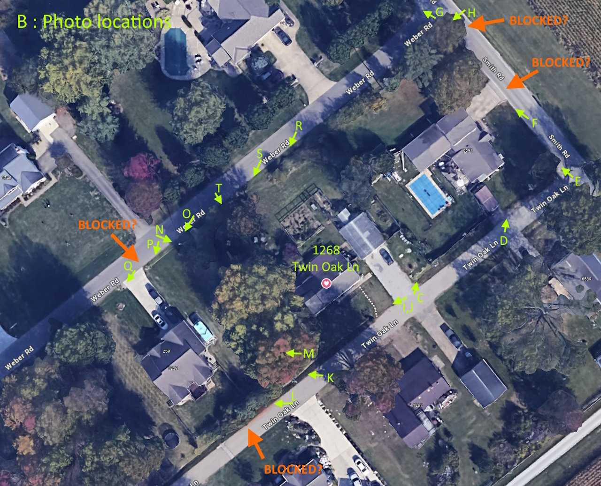

Photo C : The ditches on Twin Oak Ln, full from rainfall.  The same-level water implies that there is no blockage under the driveway.

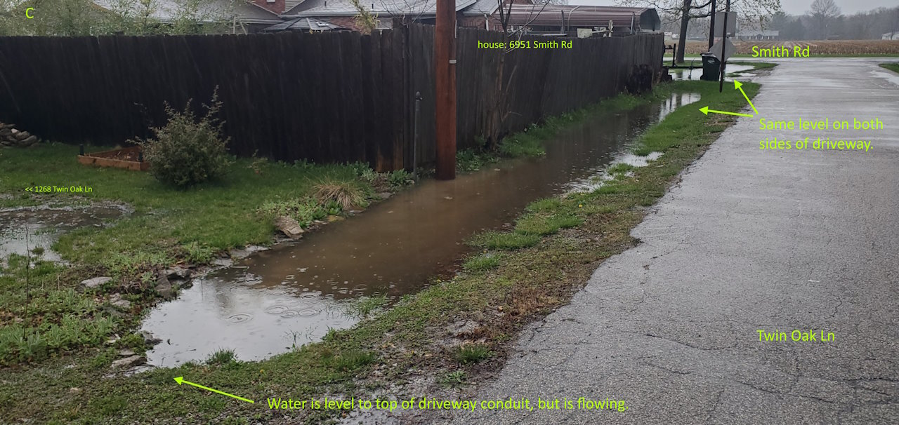

Photo D : Lawn flooding at the corner of 6951 Smith Rd.

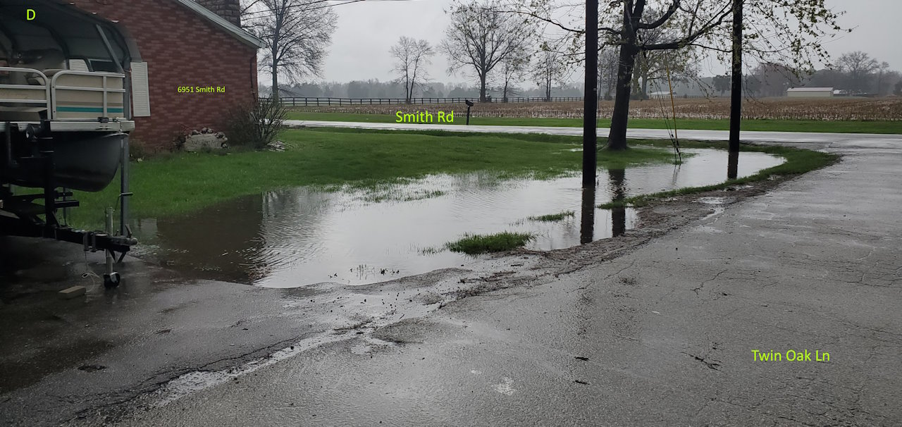

Photo E : Looking up Smith Rd.

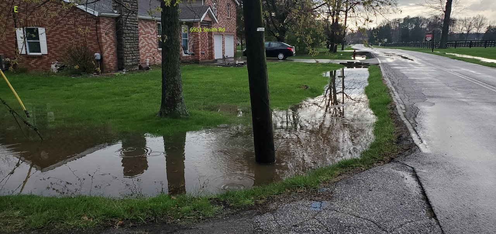

Photo F : The higher water level on the close side of the driveway implies that the conduit here is blocked.  Further, there is no evidence of outflow from the far ditch segment.

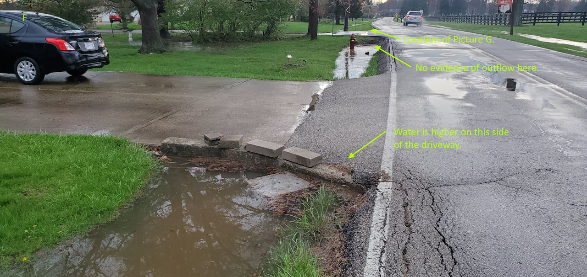

Photo G : At the corner of Smith Rd and Weber Ln, there is no obvious pipe, yet I see a small bit of percolating water.  Is the pipe covered-up?

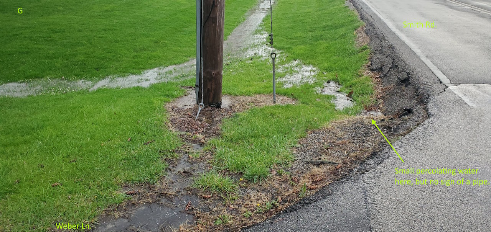

Photo H : On Smith Rd, looking down Weber Ln.

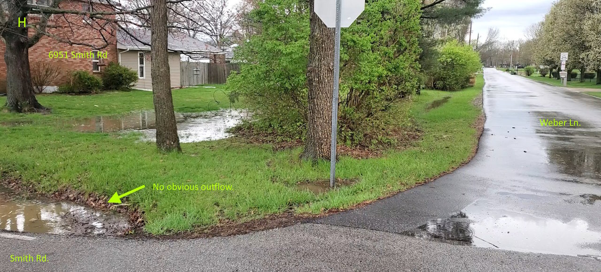

Photo I : Back at the same spot as Photo C, but looking down Twin Oak Ln.  Water under the driveway is flowing.

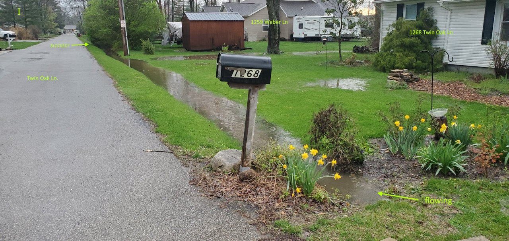

Photo K : Further down Twin Oak Ln, the full ditch is now overflowing onto the lawn, heading back towards Weber Ln.

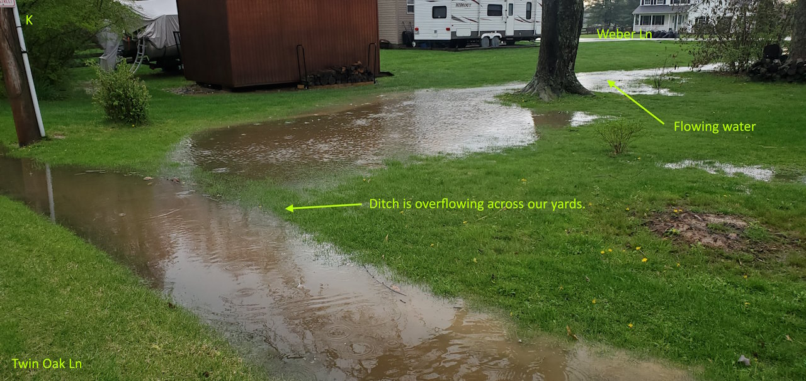

Photo L : Further down Twin Oak Ln, the ditch appears blocked by soil and vegetation.  This is the back yard of 1259 Weber Ln.

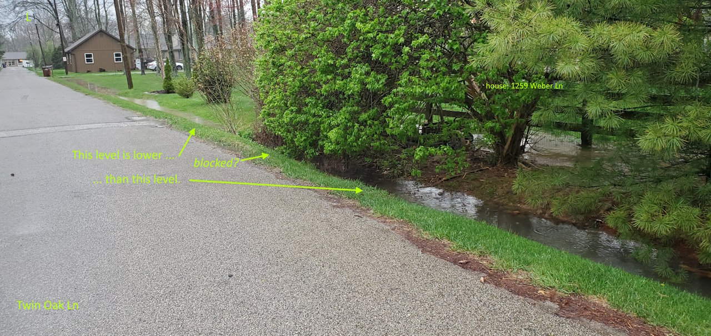

Photo N : Following the overflow from Twin Oak Ln to Weber Ln.

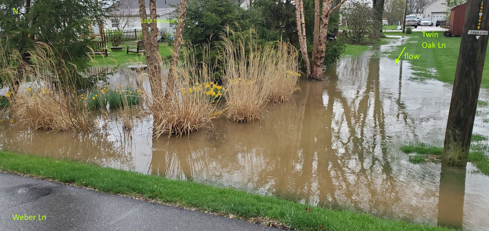

Photo O : Looking down Weber Ln, towards the driveway at 1259 Weber Ln.

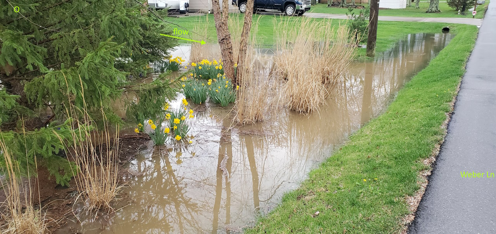

Photo P : The water appears to be blocked at the driveway of 1259 Weber Ln.

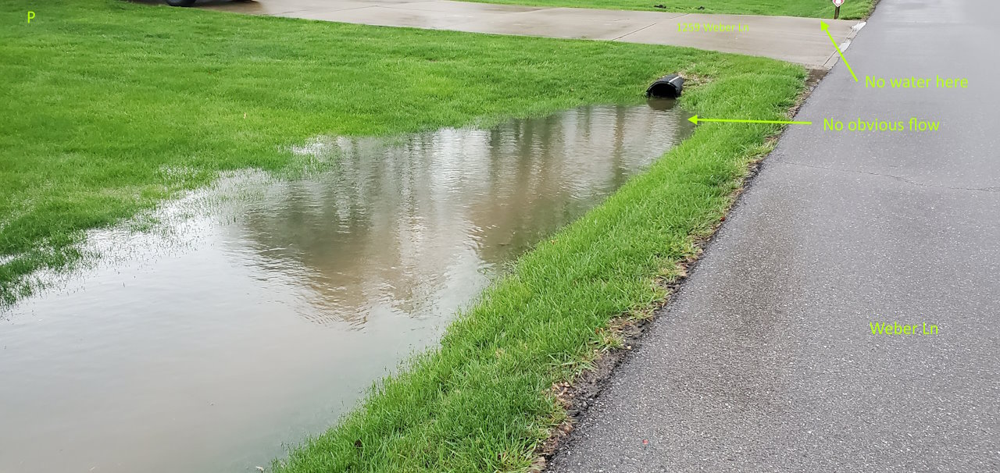

Photo Q : Close-up of the far side of the driveway, showing no water flow.

Photo R : Backing up Weber Ln towards Smith Rd, to see the ditch behind 1268 Twin Oak Ln.  This area is currently being cleared of overgrown garden by the homeowner.  It is not part of this problem, as very little water flows **through** this blocked ditch.

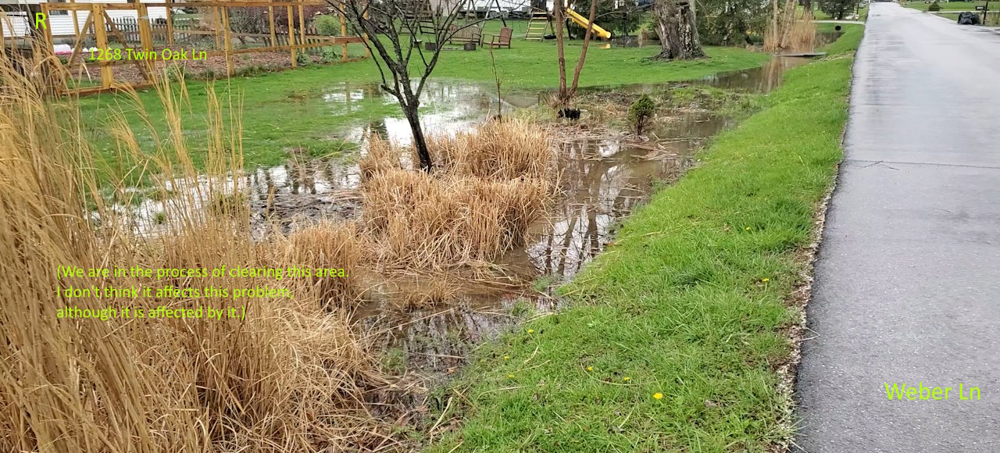

Photo S : Location of the 8" conduit outflow.

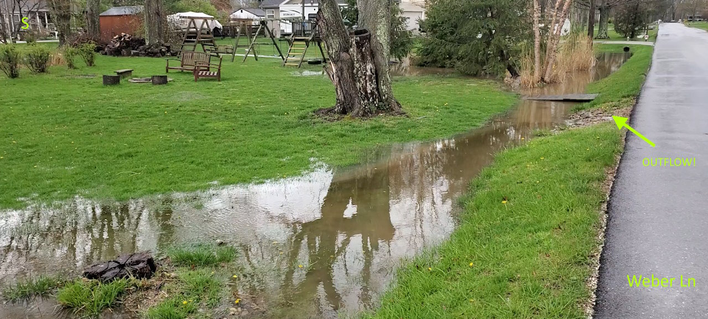

Photo T : Close-up of the 8" outflow.

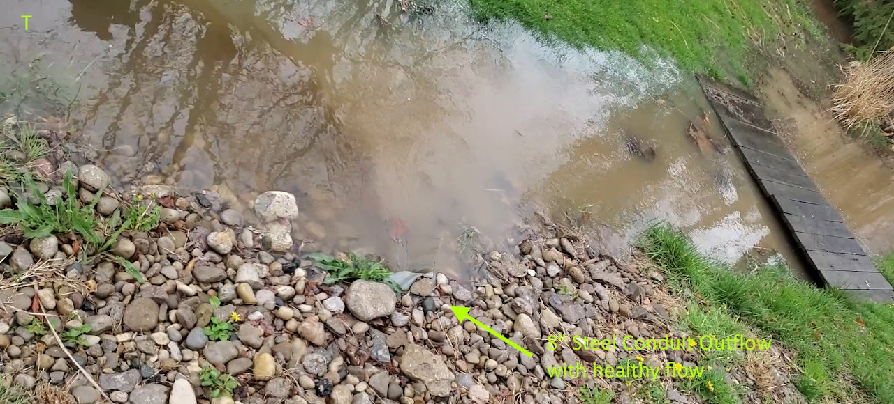

If you made it this far, THANKS!
