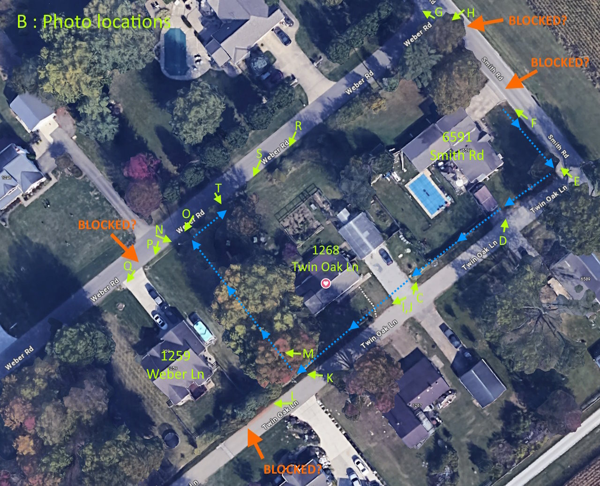
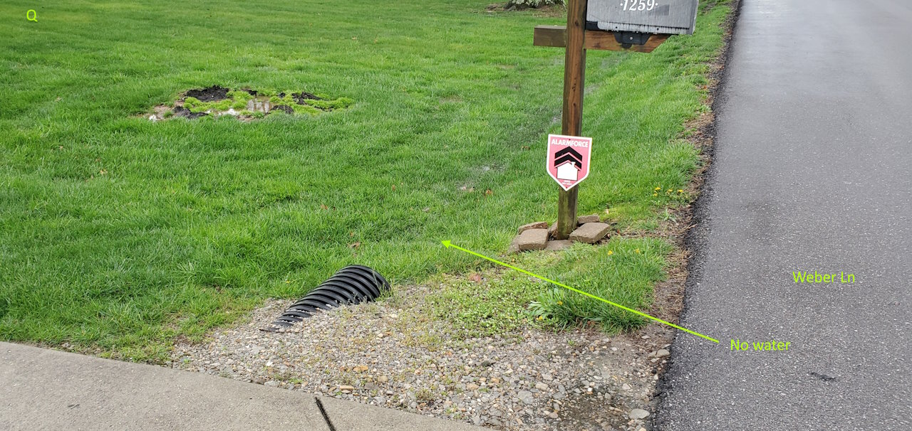

# The Ditches of 1268 Twin Oak Ln

Here's a quick tour of the blocked & overflowing ditches and conduits around 1268 Twin Oak Ln, after a typical rainfall.

I ask that you consider this situation, give your opinion on what is causing the flooding, take any action that is within the role of your office, and provide advice about anything that I should do.  I'm new to these parts, and I'm wondering who has responsibility for each of these issues, and how best to address them with my neighbors.

In brief, I think there are four spots that beg attention:  
(1) The blocked ditch on Twin Oak Ln, behind the backyard of 1259 Weber Ln,  
(2) The blocked driveway conduit at 1259 Weber Ln,  
(3) The blocked driveway conduit at 6951 Smith Rd, and  
(4) The blocked under-road conduit at Smith Rd and Weber Rd.

Due to these blockages, the rainwater from two properties overflows the Twin Oak Ln ditch, flows across the lawn, collects back in the Weber Ln ditch, then exits via an 8" conduit under Weber Ln.

It seems to me that the original design for drainage of this area includes four outflows, but only one is still working:  
  * The Twin Oak Ln ditch to the creek is blocked,
  * The Weber Ln ditch to the creek is blocked, and
  * The under-road conduit at the corner of Smith Rd/Weber Ln is blocked.
  * The 8" conduit that is under Weber Ln, behind 1268 Twin Oak Ln, is the only working outflow.

By clearing these blockages, we will allow the rain water to exit more easily, quickly and completely, which will avoid future property damage and discourage mosquitos.

Please, would you take a look at these photos, and let me know how we should move forward?

Thanks,
David Patow

---

Photo B : An overview of the properties, indicating the water flow (*blue arrows*), the location of each of the following photos (*yellow arrows*), and the 4 suspected blockages (*orange arrows*).

Photo C : Looking up Twin Oak Ln from the driveway of 1268, towards Smith Rd.  The ditches are full from a typical rainfall.  The water levels and visible flow imply that there is no blockage under either driveway.

Photo D : Lawn flooding at the corner of 6951 Smith Rd.

Photo E : Looking up Smith Rd towards Weber Ln.

Photo F : At 6951 Smith Rd, the higher water level on the close side of the driveway implies that the conduit here is blocked.  Further, there is no visible outflow from the far ditch segment.

Photo G : At the corner of Smith Rd and Weber Ln, there is no obvious pipe, yet I see a small bit of percolating water.  Is the pipe end covered?  Or, could this be free-flowing from under the roadway?

Photo H : On Smith Rd, looking down Weber Ln, towards the creek.  The ditch on Weber Ln here is quite shalllow, but I don't think that's part of the problem.

Photo I : Back at the same spot as Photo C, but looking down Twin Oak Ln, towards the creek.  Water under the driveway is flowing.  The overflow is visible.  In the distance, the blockage is indicated.

Photo K : Further down Twin Oak Ln, the full ditch is now overflowing onto the lawn, heading back towards Weber Ln.

Photo L : Further down Twin Oak Ln, the ditch appears blocked by soil and vegetation.  This is the back yard of 1259 Weber Ln.

Jumping from Twin Oak Ln over to Weber Ln, this is where the lawn overflow collects.

Photo O : Looking down Weber Ln, towards the driveway at 1259 Weber Ln.

Photo P : The water appears to be blocked at the driveway of 1259 Weber Ln.

Photo Q : Close-up of the far side of the driveway, showing no water.

Photo R : Backing up Weber Ln towards Smith Rd, to see the ditch behind 1268 Twin Oak Ln.  This area is currently being cleared by the new homeowner of pre-existing, overgrown garden.  It is not part of this problem, as no ditches flow *into* this garden area.  However, our intent is to fully restore the ditch here, as that would improve the backyard lawn drainage.

Photo S : Location of the 8" conduit outflow under Weber Ln.

Photo T : Close-up of the 8" outflow.

If you made it this far, THANKS!  I look forward to hearing your opinion about all this, and to working with you to solve it.

---
---
